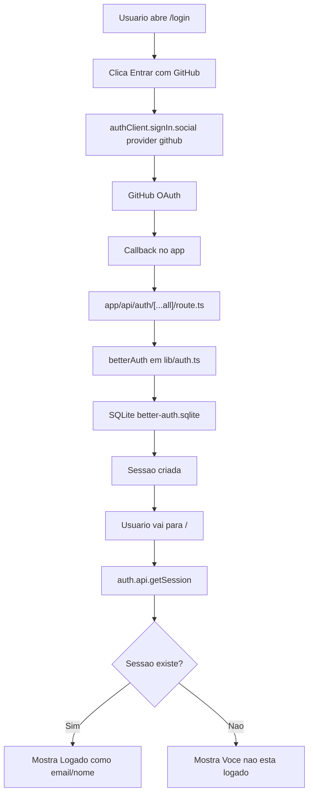

# FLUXO DO PROJETO

## 1. Objetivo

Este projeto e um demo simples de autenticacao com:

- Next.js App Router
- Better Auth
- Login social com GitHub
- Banco SQLite local com better-sqlite3

A aplicacao tem duas telas principais:

- Home: mostra se o usuario esta logado
- Login: inicia o fluxo OAuth com GitHub

## 2. Como o projeto foi estruturado

Arquivos principais:

- lib/auth.ts: configuracao central do Better Auth (providers, secret, baseURL e banco)
- lib/auth-client.ts: cliente de autenticacao para uso no frontend
- app/api/auth/[...all]/route.ts: endpoint que recebe todas as rotas de auth
- components/auth-buttons.tsx: botoes de Entrar com GitHub e Sair
- app/login/page.tsx: tela de login/signup
- app/page.tsx: home com leitura da sessao no servidor

## 3. Como funciona o login (passo a passo)

### 3.1 Inicio no frontend

Na tela de login, ao clicar em Entrar com GitHub:

- o botao chama authClient.signIn.social
- provider usado: github
- callback configurado: /

Isso inicia o fluxo OAuth e redireciona para o GitHub.

### 3.2 Rota de autenticacao no backend

Todas as rotas de auth passam por:

- app/api/auth/[...all]/route.ts

Essa rota usa toNextJsHandler(auth), que conecta o Better Auth ao Next.js.

### 3.3 Retorno do GitHub

Depois da autorizacao no GitHub:

- o usuario volta para a callback do projeto
- o Better Auth valida o retorno OAuth
- a sessao e criada e persistida no SQLite

### 3.4 Sessao exibida na Home

Na Home:

- o servidor chama auth.api.getSession com os headers da request
- se existir sessao, mostra Logado como email/nome
- sem sessao, mostra Voce nao esta logado

### 3.5 Logout

No botao Sair:

- chama authClient.signOut
- faz navegacao para /
- atualiza a pagina para refletir estado sem sessao

## 4. Como funciona o banco (SQLite)

O banco e local e criado neste arquivo:

- better-auth.sqlite

A conexao e feita em lib/auth.ts com:

- new Database("./better-auth.sqlite")

As tabelas sao criadas pela migracao do Better Auth CLI.

Entidades principais persistidas:

- user: dados do usuario
- session: sessoes ativas e expiracao
- account: vinculacao com provider social (GitHub)
- verification: tokens/fluxos de verificacao quando aplicavel

## 5. Configuracao de ambiente

Variaveis necessarias:

- BETTER_AUTH_URL
- BETTER_AUTH_SECRET
- GITHUB_CLIENT_ID
- GITHUB_CLIENT_SECRET

Essas variaveis controlam:

- URL base do auth
- segredo de assinatura de sessao
- credenciais OAuth do GitHub

## 6. Fluxo de execucao local

1. Configurar env
2. Rodar migracao
3. Subir servidor
4. Testar login

Comandos:

- npm install
- npx @better-auth/cli migrate
- npm run dev

## 7. Fluxo resumido (arquitetura)

## 8. Pontos importantes de manutencao

- Se o login nao redirecionar corretamente, validar callback URL no OAuth App do GitHub.
- Se houver erro de secret, conferir BETTER_AUTH_SECRET no env.
- Se a sessao nao persistir, conferir migracao e arquivo better-auth.sqlite.
- Sempre validar com lint e build apos mudancas em auth.
